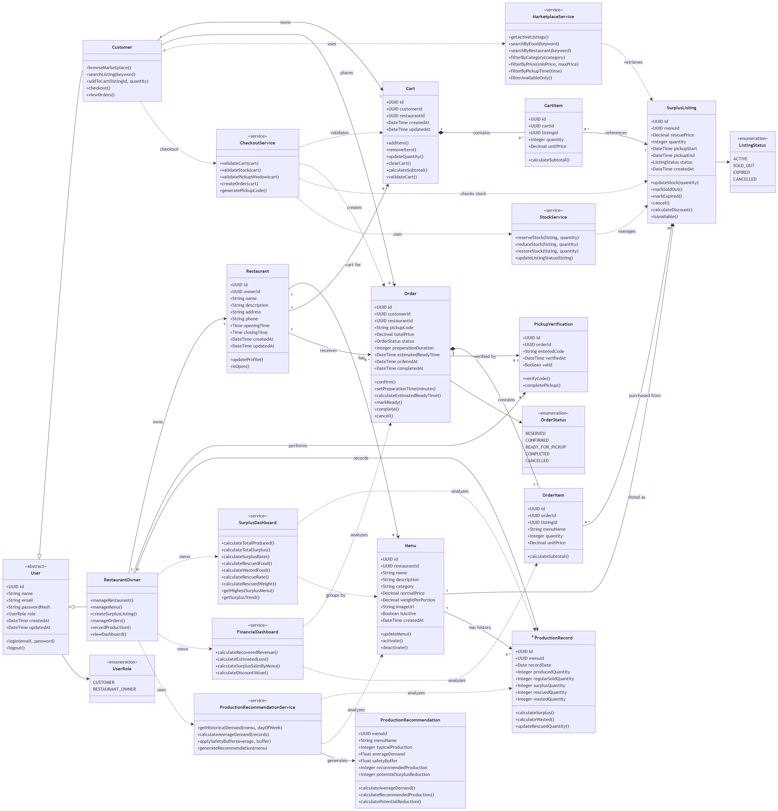

# REPLATE

Replate adalah aplikasi marketplace yang membantu restoran menjual makanan surplus yang masih layak konsumsi dengan harga lebih terjangkau. Selain membantu mengurangi food waste, Replate juga menyediakan analisis surplus dan rekomendasi jumlah produksi agar restoran dapat mengurangi kerugian serta mencegah kelebihan produksi di masa mendatang.

## Class Diagram



## Implementasi Class Diagram

Class diagram di atas diimplementasikan sebagai C# class library dengan .NET 10.

| Komponen | Hasil coding |
| --- | --- |
| Entity dan relasi | [`src/Replate.Domain/Entities`](./src/Replate.Domain/Entities) |
| Enumeration | [`src/Replate.Domain/Enums`](./src/Replate.Domain/Enums) |
| Service | [`src/Replate.Domain/Services`](./src/Replate.Domain/Services) |
| Runnable checks | [`tests/Replate.Domain.Checks/Program.cs`](./tests/Replate.Domain.Checks/Program.cs) |

Jalankan implementasi dengan:

```bash
dotnet build Replate.slnx
dotnet run --project tests/Replate.Domain.Checks/Replate.Domain.Checks.csproj
```

# REPLATE TEAM

Ketua Kelompok: Diaz Amantajati Susilo - 24/545483/TK/60678

Anggota 1: Violin Mulya Putra - 24/534192/TK/59201

Anggota 2: Putri Tajudin - 24/535824/TK/59469
